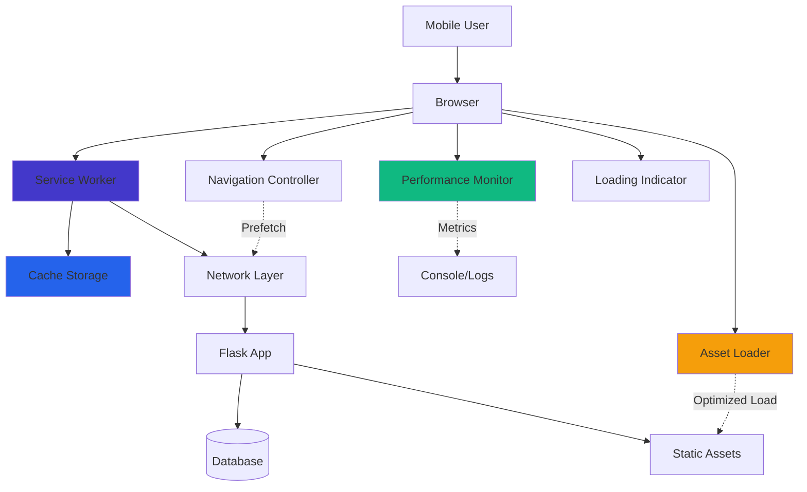
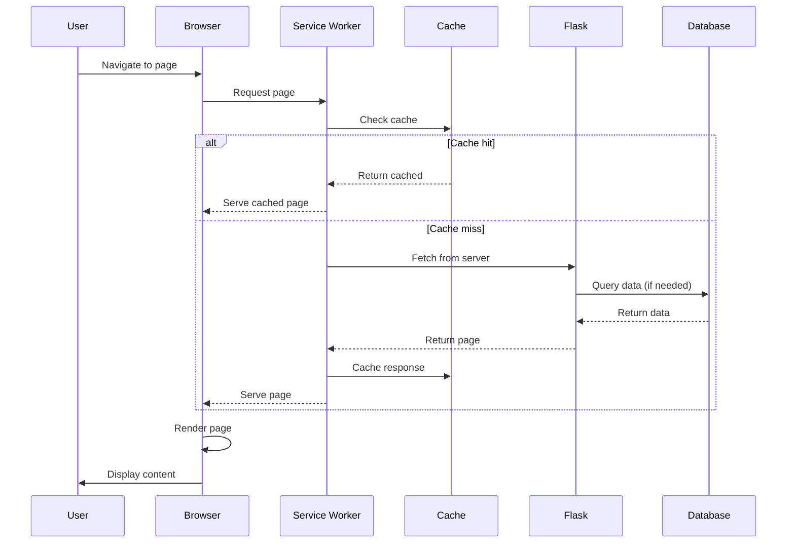

# Design Document: Mobile Performance Optimization

## Overview

This design addresses the completion of mobile performance optimization for LearnLoop, a Flask-based social learning platform. The system currently has partial optimizations in place but requires comprehensive improvements to meet performance targets: page loads under 3 seconds on 3G networks, transitions under 300ms, and efficient caching strategies.

The design focuses on five key areas:
1. Asset loading optimization (critical CSS inlining, async loading, font optimization)
2. Enhanced caching strategy (service worker improvements, database query caching)
3. Performance monitoring and measurement
4. Loading indicators and perceived performance
5. Mobile-specific optimizations

The solution leverages existing Flask infrastructure, service worker capabilities, and browser APIs to achieve performance targets without requiring major architectural changes.

## Architecture

### High-Level Architecture



### Component Interaction Flow



## Components and Interfaces

### 1. Performance Monitor

**Purpose**: Measure and track page load times, transition speeds, and performance metrics.

**Interface**:
```python
class PerformanceMonitor:
    def measure_page_load(page_url: str) -> dict:
        """
        Measures page load performance metrics.
        Returns: {
            'fcp': float,  # First Contentful Paint (ms)
            'tti': float,  # Time to Interactive (ms)
            'total': float  # Total load time (ms)
        }
        """
        pass
    
    def log_metrics(metrics: dict, page_url: str) -> None:
        """Logs performance metrics to console/storage."""
        pass
    
    def check_targets(metrics: dict) -> bool:
        """
        Checks if metrics meet performance targets.
        Returns True if all targets met, False otherwise.
        """
        pass
```

**JavaScript Interface**:
```javascript
class PerformanceMonitor {
    measurePageLoad() {
        // Uses Performance API
        // Returns { fcp, tti, total }
    }
    
    logMetrics(metrics) {
        // Logs to console and optionally sends to server
    }
    
    checkTargets(metrics) {
        // Returns true if targets met
    }
}
```

### 2. Asset Loader

**Purpose**: Manage efficient loading of CSS, JavaScript, fonts, and images.

**Interface**:
```javascript
class AssetLoader {
    inlineCriticalCSS(css: string) {
        // Inlines critical CSS in <head>
    }
    
    loadDeferredCSS(href: string) {
        // Loads non-critical CSS asynchronously
    }
    
    loadDeferredJS(src: string) {
        // Loads non-critical JavaScript with defer
    }
    
    optimizeFonts() {
        // Adds font-display: swap to font loading
    }
    
    lazyLoadImages() {
        // Implements intersection observer for images
    }
    
    prefetchPage(url: string) {
        // Prefetches page resources
    }
}
```

### 3. Cache Manager

**Purpose**: Handle browser caching, service worker caching, and API response caching.

**Service Worker Interface**:
```javascript
class CacheManager {
    cacheAssets(urls: string[], cacheName: string) {
        // Caches static assets
    }
    
    getCached(request: Request) {
        // Returns cached response if available
    }
    
    cacheResponse(request: Request, response: Response) {
        // Caches a response
    }
    
    invalidateCache(pattern: string) {
        // Removes cache entries matching pattern
    }
    
    cleanupOldCaches() {
        // Removes outdated cache versions
    }
}
```

**Python Interface**:
```python
class QueryCache:
    def get(key: str) -> Optional[Any]:
        """Returns cached query result if available and not expired."""
        pass
    
    def set(key: str, value: Any, ttl: int = 300) -> None:
        """Caches query result with TTL in seconds."""
        pass
    
    def invalidate(pattern: str) -> None:
        """Invalidates cache entries matching pattern."""
        pass
```

### 4. Navigation Controller

**Purpose**: Manage bottom navigation, page transitions, and navigation feedback.

**Interface**:
```javascript
class NavigationController {
    initBottomNav() {
        // Initializes bottom navigation bar
    }
    
    updateActiveNav(currentPath: string) {
        // Updates active navigation item
    }
    
    handleNavigation(url: string) {
        // Handles page navigation with prefetch
    }
    
    provideHapticFeedback() {
        // Provides haptic feedback on tap
    }
    
    ensureNavVisibility() {
        // Ensures nav stays visible with correct z-index
    }
}
```

### 5. Loading Indicator

**Purpose**: Display loading states and skeleton screens for better perceived performance.

**Interface**:
```javascript
class LoadingIndicator {
    show(type: 'global' | 'component' | 'skeleton') {
        // Shows loading indicator
    }
    
    hide(fadeOut: boolean = true) {
        // Hides loading indicator
    }
    
    showSkeleton(container: HTMLElement) {
        // Shows skeleton screen
    }
    
    updateProgress(percent: number) {
        // Updates progress indicator
    }
}
```

## Data Models

### Performance Metrics Model

```python
@dataclass
class PerformanceMetrics:
    page_url: str
    timestamp: datetime
    first_contentful_paint: float  # milliseconds
    time_to_interactive: float     # milliseconds
    total_load_time: float         # milliseconds
    network_type: str              # '3g', '4g', 'wifi', etc.
    device_type: str               # 'mobile', 'tablet', 'desktop'
    meets_targets: bool
```

### Cache Entry Model

```python
@dataclass
class CacheEntry:
    key: str
    value: Any
    created_at: datetime
    expires_at: datetime
    size_bytes: int
    
    def is_expired(self) -> bool:
        return datetime.now() > self.expires_at
```

### Asset Manifest Model

```javascript
interface AssetManifest {
    criticalCSS: string[];
    deferredCSS: string[];
    criticalJS: string[];
    deferredJS: string[];
    fonts: FontConfig[];
    images: ImageConfig[];
}

interface FontConfig {
    family: string;
    url: string;
    display: 'swap' | 'block' | 'fallback';
}

interface ImageConfig {
    src: string;
    lazy: boolean;
    sizes: string;
    srcset?: string;
}
```

## Implementation Strategy

### Phase 1: Asset Loading Optimization

**Critical CSS Extraction**:
- Identify above-the-fold CSS for each page type
- Inline critical CSS in `<head>` using Flask template
- Load remaining CSS asynchronously

**Font Optimization**:
- Add `font-display: swap` to Google Fonts URL
- Preload critical fonts
- Consider self-hosting fonts for better control

**JavaScript Optimization**:
- Move all non-critical scripts to end of `<body>` with `defer`
- Load Cropper.js only on profile page
- Implement code splitting for page-specific JavaScript

**Image Optimization**:
- Implement native lazy loading (`loading="lazy"`)
- Use Intersection Observer for custom lazy loading
- Serve appropriately sized images for mobile

### Phase 2: Enhanced Caching

**Service Worker Improvements**:
- Implement versioned caching with automatic cleanup
- Add cache-first strategy for static assets
- Add network-first with cache fallback for dynamic content
- Implement background sync for offline actions

**Database Query Caching**:
- Implement in-memory cache using Python dictionary with TTL
- Cache frequently accessed queries (user data, groups, messages)
- Invalidate cache on data updates
- Consider Redis for production if needed

**API Response Caching**:
- Extend existing `cachedFetch` in performance.js
- Add cache headers to Flask responses
- Implement ETags for conditional requests

### Phase 3: Performance Monitoring

**Client-Side Monitoring**:
- Use Performance API to measure FCP, TTI, total load time
- Log metrics to console in development
- Send metrics to server endpoint for analysis
- Implement performance budgets with alerts

**Server-Side Monitoring**:
- Add Flask endpoint to receive performance metrics
- Store metrics in database or log file
- Create dashboard to visualize performance trends
- Set up alerts for performance degradation

### Phase 4: Loading Indicators

**Global Loading Indicator**:
- Show spinner for page transitions > 500ms
- Use CSS animations for smooth appearance
- Position above bottom navigation

**Component Loading States**:
- Add loading states to buttons during API calls
- Show skeleton screens for content areas
- Implement progressive loading for lists

**Skeleton Screens**:
- Create skeleton components for common layouts
- Show skeletons while content loads
- Fade in real content when ready

### Phase 5: Mobile-Specific Optimizations

**Conditional Loading**:
- Detect mobile devices and load mobile-specific assets
- Skip desktop-only features on mobile
- Reduce animation complexity on slow devices

**Connection-Aware Loading**:
- Detect connection type using Network Information API
- Reduce quality/features on slow connections
- Show warning on very slow connections

**Touch Optimizations**:
- Ensure all interactive elements are 44x44px minimum
- Add haptic feedback for better tactile response
- Optimize touch event handlers with passive listeners


## Correctness Properties

*A property is a characteristic or behavior that should hold true across all valid executions of a system—essentially, a formal statement about what the system should do. Properties serve as the bridge between human-readable specifications and machine-verifiable correctness guarantees.*

### Performance Properties

**Property 1: Page load time on 3G**
*For any* page in the application, when loaded on a simulated 3G network (400 Kbps), the total load time should be less than 3000 milliseconds.
**Validates: Requirements 1.1**

**Property 2: First Contentful Paint timing**
*For any* page in the application, the First Contentful Paint metric should be less than 1500 milliseconds.
**Validates: Requirements 1.2**

**Property 3: Time to Interactive timing**
*For any* page in the application, the Time to Interactive metric should be less than 2500 milliseconds.
**Validates: Requirements 1.3**

**Property 4: Performance logging on slow loads**
*For any* page load that exceeds performance targets, the Performance_Monitor should log the metrics including FCP, TTI, and total load time.
**Validates: Requirements 1.5**

**Property 5: JavaScript execution time**
*For any* page on initial load, the total JavaScript execution time should be less than 500 milliseconds.
**Validates: Requirements 4.7**

### Navigation Properties

**Property 6: Navigation transition timing**
*For any* navigation action between pages, the transition should complete within 300 milliseconds.
**Validates: Requirements 2.1, 3.5**

**Property 7: Visual feedback timing**
*For any* tap on a navigation element, visual feedback should appear within 100 milliseconds.
**Validates: Requirements 2.2**

**Property 8: Prefetch on navigation**
*For any* navigation action, the Asset_Loader should create prefetch links for the destination page resources.
**Validates: Requirements 2.4**

**Property 9: Bottom navigation presence**
*For any* authenticated page viewed on mobile viewport, the bottom navigation bar should be present in the DOM.
**Validates: Requirements 3.1**

**Property 10: Active navigation highlighting**
*For any* page with a corresponding bottom navigation item, that navigation item should have the active class applied.
**Validates: Requirements 3.3**

### Asset Loading Properties

**Property 11: Image lazy loading**
*For any* image that is below the fold on page load, it should have either the loading="lazy" attribute or be managed by an intersection observer.
**Validates: Requirements 4.4**

**Property 12: Conditional library loading**
*For any* external library (e.g., Cropper.js), it should only be loaded on pages that require its functionality.
**Validates: Requirements 4.6**

**Property 13: Mobile-optimized assets**
*For any* mobile device detection, the Asset_Loader should load mobile-specific JavaScript and CSS files.
**Validates: Requirements 9.1**

**Property 14: Responsive image sizing**
*For any* image displayed on mobile, the served image size should be appropriate for the device viewport.
**Validates: Requirements 9.3**

**Property 15: Desktop element hiding**
*For any* mobile viewport, desktop-only navigation elements should have display:none or be removed from the DOM.
**Validates: Requirements 9.4**

**Property 16: Adaptive features on slow connections**
*For any* detected slow connection (slow-2g, 2g), the system should reduce non-essential features and animations.
**Validates: Requirements 9.6**

### Caching Properties

**Property 17: Cache hit on revisit**
*For any* static asset that has been previously loaded, a revisit should serve the asset from cache without a network request.
**Validates: Requirements 5.2**

**Property 18: API response caching with TTL**
*For any* API response that is fetched, it should be cached for 5 minutes, and repeated requests within that duration should return the cached response.
**Validates: Requirements 5.3, 7.1, 7.3**

**Property 19: Cache invalidation on update**
*For any* service worker update, outdated cache entries from previous versions should be removed.
**Validates: Requirements 5.4**

**Property 20: Offline content serving**
*For any* network request that fails when offline, if cached content is available, it should be served from the cache.
**Validates: Requirements 5.5, 10.5**

**Property 21: LRU cache eviction**
*For any* cache storage that exceeds size limits, the least recently used entries should be removed first.
**Validates: Requirements 5.7**

**Property 22: Query result caching**
*For any* database query that is repeated within 5 minutes, the cached result should be returned without executing the query again.
**Validates: Requirements 5.6, 7.3**

**Property 23: Parallel query execution**
*For any* page load requiring multiple independent database queries, those queries should execute in parallel rather than sequentially.
**Validates: Requirements 7.2**

### Loading Indicator Properties

**Property 24: Loading indicator display**
*For any* operation (page load, API request, or transition) that exceeds 500 milliseconds, a loading indicator should be displayed.
**Validates: Requirements 6.1, 6.2, 6.3**

**Property 25: Loading indicator fade-out timing**
*For any* loading operation that completes, the loading indicator should fade out within 200 milliseconds.
**Validates: Requirements 6.5**

**Property 26: Global loading state**
*For any* scenario with multiple concurrent loading operations, a global loading indicator should be displayed.
**Validates: Requirements 6.6**

### Monitoring Properties

**Property 27: Performance metrics collection**
*For any* page load, the Performance_Monitor should collect and log FCP, TTI, and total load time metrics.
**Validates: Requirements 8.2**

**Property 28: Performance target flagging**
*For any* page load that fails to meet performance targets (FCP > 1.5s, TTI > 2.5s, or total > 3s), the Performance_Monitor should flag the issue.
**Validates: Requirements 8.3**

### Mobile Interaction Properties

**Property 29: Haptic feedback on touch**
*For any* touch interaction on a navigation or button element, when the device supports haptic feedback, the vibration API should be called.
**Validates: Requirements 9.2**

### Service Worker Properties

**Property 30: Cache-first for static assets**
*For any* request for static assets (CSS, JS, images), the service worker should attempt to serve from cache first before making a network request.
**Validates: Requirements 10.2**

**Property 31: Network-first for dynamic content**
*For any* request for dynamic content (HTML pages, API endpoints), the service worker should attempt network first and fall back to cache on failure.
**Validates: Requirements 10.3**

**Property 32: Selective response caching**
*For any* response being cached by the service worker, only responses with status code 200 should be stored in the cache.
**Validates: Requirements 10.6**

## Error Handling

### Network Errors

**Offline Detection**:
- Detect offline state using `navigator.onLine`
- Show offline indicator to user
- Queue actions for background sync when online
- Serve cached content when available

**Timeout Handling**:
- Set timeout for network requests (10 seconds)
- Fall back to cache on timeout
- Show error message if no cache available
- Provide retry mechanism

**Failed Requests**:
- Catch fetch errors in service worker
- Attempt cache fallback
- Log errors for debugging
- Show user-friendly error messages

### Cache Errors

**Cache Storage Full**:
- Implement LRU eviction policy
- Remove oldest entries when storage limit reached
- Log cache eviction events
- Ensure critical assets are never evicted

**Cache Corruption**:
- Validate cached responses before serving
- Remove corrupted cache entries
- Re-fetch from network if cache invalid
- Rebuild cache if necessary

**Service Worker Errors**:
- Catch and log service worker errors
- Provide fallback to network-only mode
- Show update prompt if service worker fails
- Allow manual service worker reset

### Performance Errors

**Slow Load Detection**:
- Monitor load times continuously
- Show warning if consistently slow
- Suggest connection check to user
- Reduce features on persistent slow loads

**Memory Issues**:
- Monitor memory usage in development
- Limit cache size to prevent memory issues
- Clean up event listeners and observers
- Use weak references where appropriate

**JavaScript Errors**:
- Wrap critical code in try-catch blocks
- Log errors to console and optionally to server
- Provide graceful degradation
- Show user-friendly error messages

## Testing Strategy

### Dual Testing Approach

This feature requires both unit tests and property-based tests to ensure comprehensive coverage:

**Unit Tests**: Focus on specific examples, edge cases, and integration points
- Test specific page load scenarios
- Test cache hit/miss scenarios
- Test offline mode with specific pages
- Test service worker installation and updates
- Test loading indicator appearance/disappearance
- Test navigation between specific pages

**Property-Based Tests**: Verify universal properties across all inputs
- Test page load performance across random pages
- Test caching behavior with random URLs and data
- Test navigation timing across random page pairs
- Test asset loading across random asset types
- Test loading indicators with random operation durations

### Property-Based Testing Configuration

**Testing Library**: Use **fast-check** for JavaScript property-based testing (for client-side code) and **Hypothesis** for Python property-based testing (for server-side code)

**Test Configuration**:
- Minimum 100 iterations per property test
- Each test must reference its design document property
- Tag format: **Feature: mobile-performance-optimization, Property {number}: {property_text}**

**Example Property Test Structure**:
```javascript
// Feature: mobile-performance-optimization, Property 1: Page load time on 3G
fc.assert(
  fc.property(
    fc.constantFrom('/dashboard', '/groups', '/messages', '/profile', '/voice-rooms'),
    async (pageUrl) => {
      const metrics = await measurePageLoad(pageUrl, { networkSpeed: '3g' });
      return metrics.total < 3000;
    }
  ),
  { numRuns: 100 }
);
```

### Testing Priorities

**High Priority** (Must test):
1. Page load performance on 3G (Property 1, 2, 3)
2. Caching behavior (Property 17, 18, 20, 22)
3. Navigation timing (Property 6, 7)
4. Service worker strategies (Property 30, 31, 32)

**Medium Priority** (Should test):
5. Loading indicators (Property 24, 25, 26)
6. Asset loading optimization (Property 11, 12, 13)
7. Mobile-specific behavior (Property 13, 14, 15, 16)
8. Performance monitoring (Property 27, 28)

**Low Priority** (Nice to test):
9. Haptic feedback (Property 29)
10. Parallel query execution (Property 23)
11. Cache eviction (Property 21)

### Integration Testing

**End-to-End Performance Tests**:
- Test complete user flows with performance monitoring
- Measure performance on real devices
- Test on actual 3G networks (not just simulated)
- Test with various cache states (empty, partial, full)

**Cross-Browser Testing**:
- Test on Chrome, Firefox, Safari (desktop and mobile)
- Test service worker behavior across browsers
- Test performance API availability
- Test fallbacks for unsupported features

**Device Testing**:
- Test on low-end mobile devices
- Test on various screen sizes
- Test with different connection speeds
- Test with limited memory/storage

### Performance Testing Tools

**Automated Tools**:
- Lighthouse CI for continuous performance monitoring
- WebPageTest for detailed performance analysis
- Chrome DevTools Performance panel
- Network throttling in DevTools

**Manual Testing**:
- Real device testing on 3G networks
- User testing for perceived performance
- A/B testing for optimization impact
- Load testing for server performance

### Test Coverage Goals

- **Unit Test Coverage**: 80% of JavaScript and Python code
- **Property Test Coverage**: All 32 correctness properties
- **Integration Test Coverage**: All critical user flows
- **Performance Test Coverage**: All pages and major features
